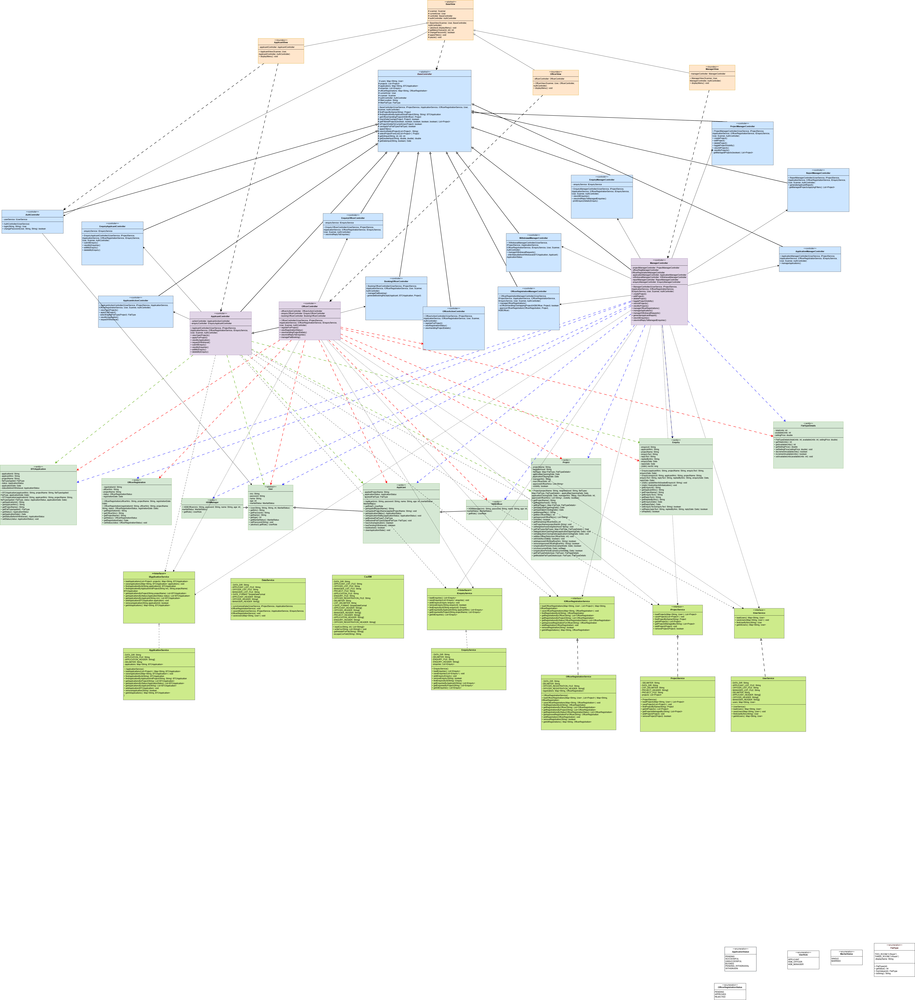
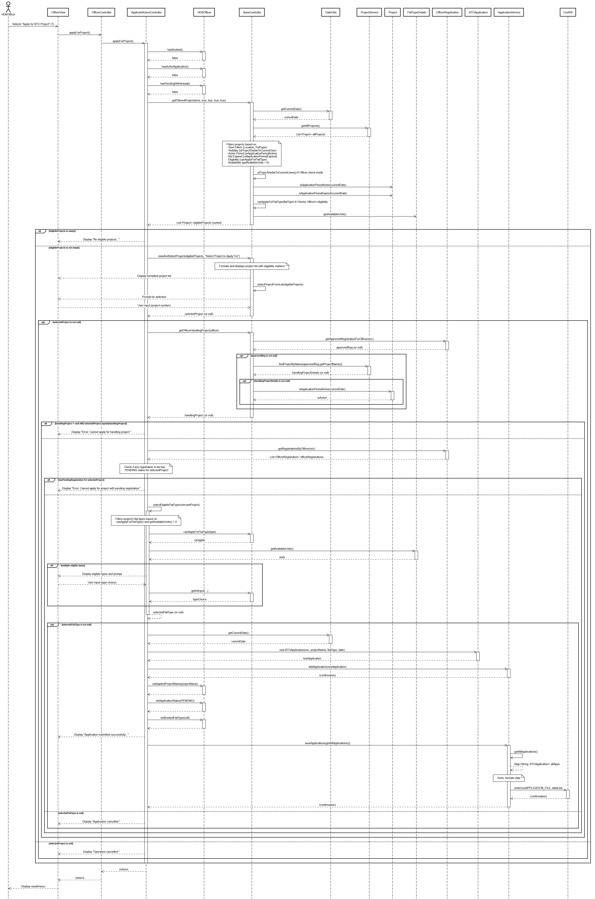
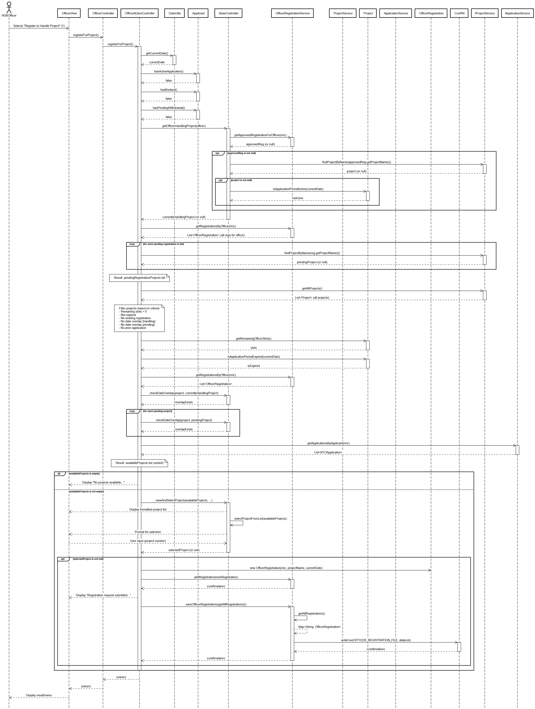

# BTO Management System

## Members
- Chew Jun Yang - U2323006A
- Jayaraj Kishore Kumar - U2423796B
- Jordan Chia Zhi Heng - U2421931C
- Kong Kai Wang - U2323506H
- Patrick Elliot Subagio - U2420459E

## Overview

SC2002 Project, console-based Java app to simulate a Build-To-Order system, the app features different user roles to interact and mange projects, applications, registrations and enquires.

## Project Structure

The project follows a Model-View-Controller (MVC) structure with additional layers:

- `Controllers`: Handle user input, routes actions, and interact with Services. Contains base controllers and role-specific controllers (Controllers delegate tasks to sub tasks).
- `Models`: Represent data entities (User, Project, Application, Enquiry, etc.).
- `Services`: Manage business logic and data access operations (loading/saving from CSV).
- `Views`: Responsible for displaying information and menus to the user via the console.
- `Enums`: Define constant types (UserRole, ApplicationStatus, FlatType, etc.).
- `Utils`: Contain utility classes (DateUtils, NricValidator).
- `Parsers`: Contain helper classes for parsing data (Dates, Lists from strings).
- `BTOApp.java`: Main application class (entry point).

## Data Storage

All application data is stored in CSV files within a `data` directory relative to the execution path. Key files include:

`ApplicantList.csv` - Stores Applicant info like Marital Status, NRIC, password
`OfficerList.csv` - Stores Officer info like Marital Status, NRIC, password
`ManagerList.csv` - Stores Manager info like Marital Status, NRIC, password
`ProjectList.csv` - Stores Project info like project name, location, flat type, flat type availability
`applications.csv` - Stores BTO application info like project, flat type applied, project applied, application NRIC
`enquiries.csv` - Stores Enquiry info like sender, project, enquiry text, reply
`officer_registrations.csv` - Stores Officer registration info like project, officer NRIC, status

The system attempts to create these files with headers if they don't exist upon startup

## How to Run
1. Populate the `data` directory with the required CSV files, I created another directory called `Test Start Data` that contains sample starting state CSVs that can be copied to the `data` directory
2. Run the command
```
javac BTOApp.java & java BTOApp
```

## Report
The project report is in the base folder alongside BTOApp.java and this README.md called `Report.pdf`

## Test Cases
The test cases we used can be found in Test Cases.pdf, there are 4 columns, test number, success case, failure case and Copy, where copy is lines of command that can be copied into the console to run the test case

## Test Results
We ran the test cases and stored images of each output to the folder `Test`

## Javadoc
The java doc can be found in the `html` folder

## Class Diagram


## Sequence Diagram (Application)


## Sequence Diagram (Registration)


## Key Features

### User Roles & Actions
1. Applicant:
- View available BTO projects 
- Apply for a BTO project and select a flat type
- View their application status
- Request withdrawal of their application
- Submit, view, edit, and delete enquiries about projects

2. HDB Officer:
- Includes all Applicant actions
- Register interest to handle specific BTO projects
- View their registration status (Pending, Approved, Rejected)
- View details of the project they are currently handling
- View and reply to enquiries submitted for the project they handle
- Manage the flat booking process for applicants with successful applications for their handled project

3. HDB Manager:
- Create, Read, Update, and Delete BTO projects they manage
- Toggle the public visibility of managed projects
- View all projects in the system or only those they manag
- Manage HDB Officer registration requests for their projects (Approve/Reject)
- Manage BTO applications for their projects (Approve/Reject)
- Manage applicant withdrawal requests for their projects (Approve/Reject)
- Generate reports of booked flats for their projects
- View all enquiries system-wide or view/reply to enquiries for managed projects

### Common Features

- User authentication
- Password change
- Ability to apply/clear filters (Location, Flat Type) for project views
- Data persistence using CSV files
